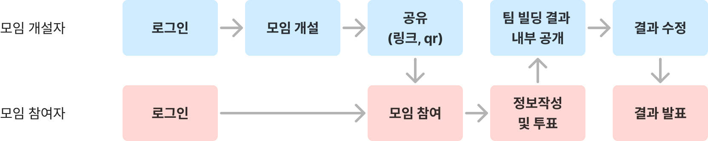
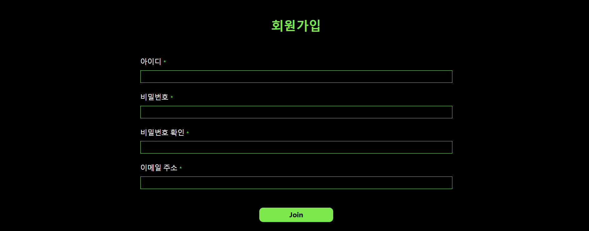
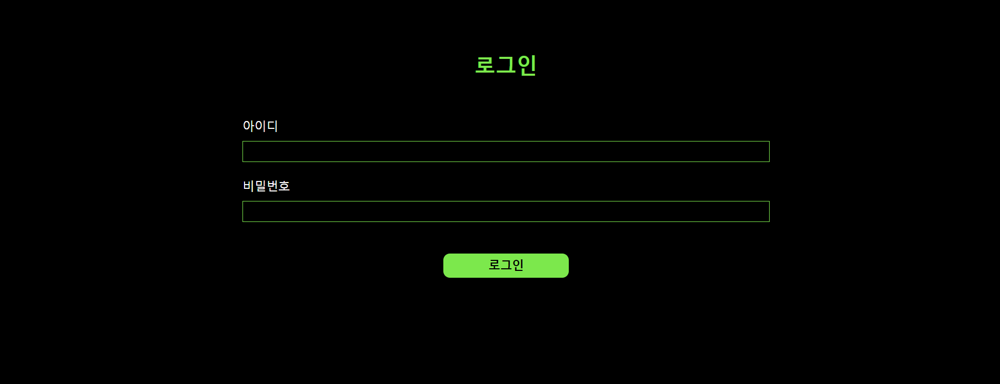
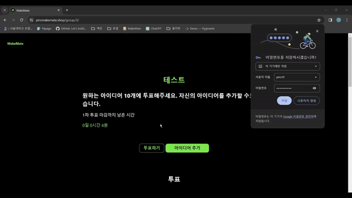

# MakeMate

### 효율적인 동아리 운영을 위한 팀 빌딩 자동화 서비스

https://www.piromakemate.shop/

개발 기간: 2024/01/30~2024/02/20 (총 22일)

피로그래밍 20기 최종 프로젝트

## 프로젝트 소개

- 피로그래밍 최종 프로젝트 팀빌딩 시 사용할 수 있는 인터널 앱입니다.
- 팀빌딩 그룹을 개설하면 1차, 2차, 3차 투표가 진행됩니다.
- 각 투표 진행 시 참여자들은 아이디어를 올리거나 투표할 수 있습니다.
- 투표가 종료되면 알고리즘에 의해 결정된 팀 빌딩 결과를 운영진에게 제공합니다.
    - 실력과 팀 지망에 따라 알고리즘을 구축하였습니다.
- 운영진은 팀 빌딩 결과를 수정하고 참여자들에게 발표할 수 있습니다.

### UserFlow

## 시연 영상

[MakeMate 시연 영상 링크 (YouTube)](https://youtu.be/6fRprCYuKU4)

https://github.com/Pirogramming-20/MakeMate

## 기술 스택

- FE
    - vanilla javascript
- BE
    - Django
- Deploy
    - nginx/gunicorn
    - AWS EC2
- 라이브러리
    - APScheduler: 함수를 특정 시간에 실행시키기 위해 사용
    - Numpy: N dimension Array 데이터 처리를 위해 사용

## 팀원

| 김연우 (팀장) | 강용현 | 김하영 | 송하종 |
| --- | --- | --- | --- |
| @Yeonu-Kim | @khyeon1003 | @HayoungGloria | @hjsong123 |

## 역할 분담

- 김연우 (팀장)
    - UI/UX 디자인  기획
    - 회원가입/로그인/로그아웃
    - 모임 생성 및 인증
    - 배포
- 강용현
    - 메인 페이지
    - 운영자 페이지
    - 회원 정보 수정
    - 팀 빌딩 알고리즘 구현
    - APScheduler 활용 팀빌딩 함수 실행 관리
- 김하영
    - UI/UX 디자인
    - 그룹 디테일 페이지
    - 아이디어 생성/수정/삭제
    - 투표 생성 및 수정
- 송하종
    - 임시결과 제공 및 수정
    - 결과 발표
    - 권한 인가
    - 팀 빌딩 알고리즘 구현

## 페이지별 기능

### 초기 화면

- 로그인하지 않았을 때
    - 로그인 및 회원가입 버튼이 나타납니다.
- 로그인했을 때
    - 로그아웃 및 모임 개설 버튼이 나타납니다.
    - 내가 속한 모임의 리스트가 나타납니다.

로그인 전

로그인 후

로그인 후 내가 속한 모임 리스트

### 로그인/회원가입

- 장고 자체 로그인 및 회원가입 기능을 사용하여 구현하였습니다.
- form 에러 발생 시 field 아래에 에러가 나타나도록 구현했습니다.

회원가입

로그인

에러 발생 시 경고 문구

### 모임 개설 (운영자)

- 총 세 단계를 거쳐 모임을 개설합니다.
    - 1단계: 모임 이름, 비밀번호
    - 2단계: 초기 정보(실력)에 대한 설명
    - 3단계: 1, 2, 3차 투표 마감일
- Ajax를 사용하여 모든 단계를 거쳤을 때만 모임 정보가 DB에 저장될 수 있도록 구현했습니다.
    - 이전 단계로 이동 기능은 아직 구현하지 못했습니다.
- 잘못된 값을 입력했을 경우에는 필드 아래에 에러 메세지가 나타나도록 구현했습니다.
    - 특히 3단계에서는 1차 투표 마감기한 < 2차 투표 마감기한 < 3차 투표 마감기한 조건을 만족하도록 구현하였습니다.
- 모임 개설 이후에는 참여자에게 공유할 링크와 비밀번호를 확인하는 창으로 이동합니다.
- 모임을 개설한 사람은 자동으로 운영자로 등록됩니다.

### 모임 가입 (참여자)

- 제공받은 링크를 통해 들어가면 모임 참여자 확인 창이 나타납니다.
- 비밀번호와 초기 정보(실력)를 입력하면 모임에 가입됩니다.
    - 각 실력에 대한 설명은 “모임 개설” 2단계에서 설정한 값으로 나타납니다.

### 아이디어 생성/수정/삭제 (참여자)

- 1차 투표
    - 나의 아이디어가 없을 때는 “아이디어 생성” 버튼이 나타납니다.
        - 각자의 팀 프로젝트 아이디어를 생성할 수 있습니다.
        - 발표 자료는 파일 업로드 기능을 사용하여 올릴 수 있습니다. (최대 4M)
    - 다른 사람의 아이디어는 디테일 페이지에서 확인할 수 있습니다.
    - 나의 아이디어가 있으면 “아이디어 수정” 버튼이 나타납니다.

- 2, 3차 투표
    - 나의 아이디어가 선정된 경우에는 아이디어를 수정할 수 있습니다.
    - 나의 아이디어가 선정되지 않은 경우에는 아이디어 수정 페이지가 나타나지 않습니다.

### 투표하기 (참여자)

- 자신이 원하는 아이디어에 대해 투표할 수 있습니다.
    - 투표 조건에 맞지 않는 경우 투표 내용이 저장되지 않으며 에러 메세지가 나타납니다.
- 투표 조건
    - 1차 투표: 무지망으로 10개 선정
    - 2차 투표: 무지망으로 5개 선정, 1차 투표에서 선발된 아이디어만 투표 가능
    - 3차 투표: 3지망 투표, 2차 투표에서 선발된 아이디어만 투표 가능
- 투표 이후에는 투표 내용을 수정할 수 있습니다.

1차 투표하기

1차 투표 수정

2차 투표

3차 투표

### 운영자 페이지 (운영자)

- 모임에 가입한 회원의 정보를 수정하거나 아이디어를 삭제할 수 있습니다.
- 운영자/비운영자(참여자) 여부를 수정할 수 있습니다.

운영진/비운영진 정보 변경

실력 정보 수정

### 임시 결과 페이지 (운영자)

- 1차 투표 (아이디어 뽑기)
    - 상위 10개의 팀을 미리 선택해둔 상태에서 운영자가 결과를 수정할 수 있도록 합니다.
    - 아이디어는 투표순으로 나열됩니다.
    - 발표하기 버튼을 누르면 2차 투표가 시작됩니다.

- 2차 투표 (아이디어 뽑기)
    - 상위 5개 팀을 미리 선택해둔 상태에서 운영자가 결과를 수정할 수 있도록 합니다.
    - 발표하기 버튼을 누르면 3차 투표가 시작됩니다.

- 3차 투표 (팀원 변경하기)
    - 팀원의 실력, 지망에 따라 알고리즘에 의해 결정된 결과를 운영진에게 제공합니다.
    - 팀원 정보를 수정할 수 있습니다.

### 임시 결과 페이지 (참여자)

- 투표가 종료된 이후에는 “투표하기” 버튼이 나타나지 않습니다.

### 결과 페이지

- 최종 팀빌딩 결과를 보여줍니다.

## 구현 디테일

### 팀 빌딩 알고리즘

- 팀빌딩 방식
    - 수식을 사용하여 각 팀의 적합도 점수를 계산합니다.
    - 각 팀의 적합도 최대 값을 가진 회원을 선정합니다.
    - 최대 값을 가진 회원 중 적합도 점수가 최소인 회원에 대해 먼저 팀을 할당합니다.
    - 해당 방식을 반복하여 팀빌딩을 마무리합니다.
- 팀 빌딩 함수는 3차 투표가 마무리되는 시점에 1회만 시행됩니다. (APScheduler 사용)
    - 이러한 방식을 통해 서버 부하를 줄입니다.

### 권한 인가

- 로그인/비로그인, 참여자/운영자, 투표 중/투표 종료에 따라 페이지 접근 가능 유무가 달라집니다.
- 링크로 권한이 없는 유저가 접근하는 경우, 각 유저가 접근할 수 있는 페이지로 리다이렉트 시킵니다.
